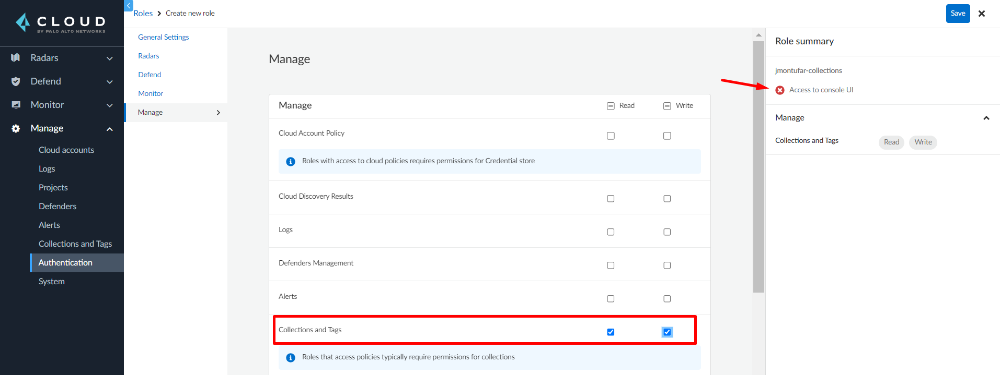

# Prisma Cloud Compute API Collections
Prisma Cloud Compute API management of compute collections.

This script is meant for creating, updating and deleting collections on Prisma Cloud Compute.

## Requirements
1. Prisma Cloud Enterprise or self-hosted version

## Usage
* Creating a single collection

>>```$ python3 manageCollection.py --collection-name $COLLECTION_NAME --username $PRISMA_USERNAME --password $PRISMA_PASSWORD --compute-api-endpoint $COMPUTE_API_ENDPOINT --images $IMAGE_1 $IMAGE_2 ... $IMAGE_N --hosts $HOST_1 $HOST_2 ... $HOST_N --labels $LABEL_1 $LABEL_2 ... $LABEL_N --containers $CONTAINER_1 $CONTAINER_2 ... $CONTAINER_N --functions $FUNCTION_1 $FUNCTION_2 ... $FUNCTION_N --namespaces $NAMESPACE_1 $NAMESPACE_2 ... $NAMESPACE_N --app-ids $APPID_1 $APPID_2 ... $APPID_N --account-ids $ACCOUNT_1 $ACCOUNT_2 ... $ACCOUNT_N --code-repos $REPO_1 $REPO_2 ... $REPO_N --clusters $CLUSTER_1 $CLUSTER_2 ... $CLUSTER_N --color #000000 --override --skip-tls-verify```

* Creating a single collection using a JSON file

>>```$ python3 manageCollection.py --username $PRISMA_USERNAME --password $PRISMA_PASSWORD --compute-api-endpoint $COMPUTE_API_ENDPOINT --file $FILENAME --skip-tls-verify```

* Creating multiple collections using a directory path with JSON files

>>```$ python3 manageCollection.py --username $PRISMA_USERNAME --password $PRISMA_PASSWORD --compute-api-endpoint $COMPUTE_API_ENDPOINT --path $PATH --skip-tls-verify```

* Deleting a single collection

>>```$ python3 manageCollection.py --collection-name $COLLECTION_NAME --username $PRISMA_USERNAME --password $PRISMA_PASSWORD --compute-api-endpoint $COMPUTE_API_ENDPOINT --delete --skip-tls-verify```

* Deleting multiple collections

>>```$ python3 manageCollection.py --collection-name $COLLECTION_NAME --username $PRISMA_USERNAME --password $PRISMA_PASSWORD --compute-api-endpoint $COMPUTE_API_ENDPOINT --delete-list $COLLECTION_1 $COLLECTION_2 ... $COLLECTION_N --skip-tls-verify```

### Parameters
* ```--collection-name``` (optional): Name of the collection to be created, updated or deleted.
* ```--username``` (required): Name of the user to be used. For Prisma Cloud SaaS version, this would be the value of the Access Key ID if you are using access keys.
* ```--password``` (required): Password of the user to be used. For Prisma Cloud SaaS version, this would be the value of the Secret Key if you are using access keys.
* ```--compute-api-endpoint``` (required): API endpoint of the Prisma Cloud Compute console. For SaaS version, you can find this in the Compute console under **Manage** > **System** > **Utilities**. 
* ```--images``` (optional): Images to be scoped by the collection. If not set it will use the wildcard value of **[*]**.
* ```--hosts``` (optional): Hosts to be scoped by the collection. If not set it will use the wildcard value of **[*]**.
* ```--labels``` (optional): Labels to be scoped by the collection. If not set it will use the wildcard value of **[*]**.
* ```--containers``` (optional): Containers to be scoped by the collection. If not set it will use the wildcard value of **[*]**.
* ```--functions``` (optional): Functions to be scoped by the collection. If not set it will use the wildcard value of **[*]**.
* ```--app-ids``` (optional): App IDs to be scoped by the collection. If not set it will use the wildcard value of **[*]**.
* ```--account-ids``` (optional): Account IDs to be scoped by the collection. If not set it will use the wildcard value of **[*]**.
* ```--code-repos``` (optional): Code repositories to be scoped by the collection. If not set it will use the wildcard value of **[*]**.
* ```--clusters``` (optional): Clusters to be scoped by the collection. If not set it will use the wildcard value of **[*]**.
* ```--color``` (optional): Color to be used by the collection on the Web UI. This must be an hexadecimal value. By default it's value is **#000000** which represents the color black.
* ```--override``` (optional): Override an existing collection. If set and the collection does not exists, then will create a new collection. If set and the collection exists, the collection will be updated. If not set and the collection exists on prisma, the script will fail. 
* ```--delete``` (optional): Delete an existing collection. 
* ```--delete-list``` (optional): Delete multiple existing collections.
* ```--file``` (optional): Create a collection using a JSON file.
* ```--path``` (optional): Create multiple collections using a directory path that contains JSON files.
* ```--skip-tls-verify``` (optional): Skip TLS verification of the Compute API Endpoint.

### Environment variables
Instead of explicitly input the values of some parameters in the script, you can substitute them by using environment variables. Those variables are:

|       Variable       |     Parameter substituted    |
|----------------------|------------------------------|
|    PRISMA_USERNAME   |       ```--username```       |
|    PRISMA_PASSWORD   |       ```--password```       |
| COMPUTE_API_ENDPOINT | ```--compute-api-endpoint``` |
|      SKIP_VERIFY     |   ```--skip-tls-verify```    |

You can either use it as an OS environment variable or write a .env file with this variables included, but if the parameter is input while running the script, this will override the environment variable.

The value of SKIP_VERIFY must be 0 or 1.

### JSON file format
The format to be used for creating collections using files is as follows:
```json
{
    "name": "string",
    "images": ["*"],
    "hosts": ["*"],
    "labels": ["*"],
    "containers": ["*"],
    "functions": ["*"],
    "namespaces": ["*"],
    "appIDs": ["*"],
    "accountIDs": ["*"],
    "codeRepos": ["*"],
    "clusters": ["*"], 
    "color": "#000000"
}
```

This format must be used as well when you are creating multiple collections from a directory.

The value of ["*"] means it will take any possible value. You can see a sample in **samples/sample.json**

## Least privilege permissions
### Prisma Cloud SaaS version
In order to grant the least privileges to a user or service account in the SaaS version of Prisma Cloud, you must create a Permissions Group with View and Update for the Collections and Tags permission. While you are creating a Permissions Group, the Cloud Account Policy permission can be found under **Assing Permissions** > **Compute** > **Manage** as in the following image:


Once created this permissions group, you must create a role and then the belonging user or service account.

>**NOTE**
> * You must assing an account group to the role. Be sure to add the account groups of the accounts you need to modify. 
> * Is recommended to use a service account and access key.
> <br/><br/>

### Prisma Cloud self-hosted version
In order to grant the least privileges to a user in the self-hosted version of Prisma Cloud, you must create a role with Read and Write for the Cloud Account Policy permission and no access to the Console IU. While you are creating a Role, the Collections and Tags permission can be found under the Manage tab as in the following image:



Once created this role, you must create the belonging user.

## Install dependencies
Install requirements:

`$ pip install -r requirements.txt`

It's recommended to use a virtual environment.

> **NOTE** 
> * This script was tested in Python 3.10 and pip version 22.3.1.
> <br/><br/>
